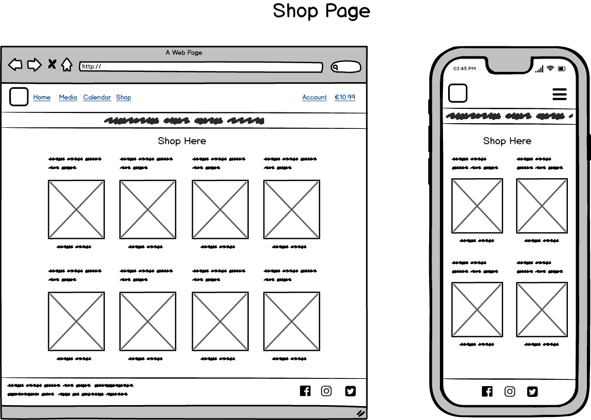
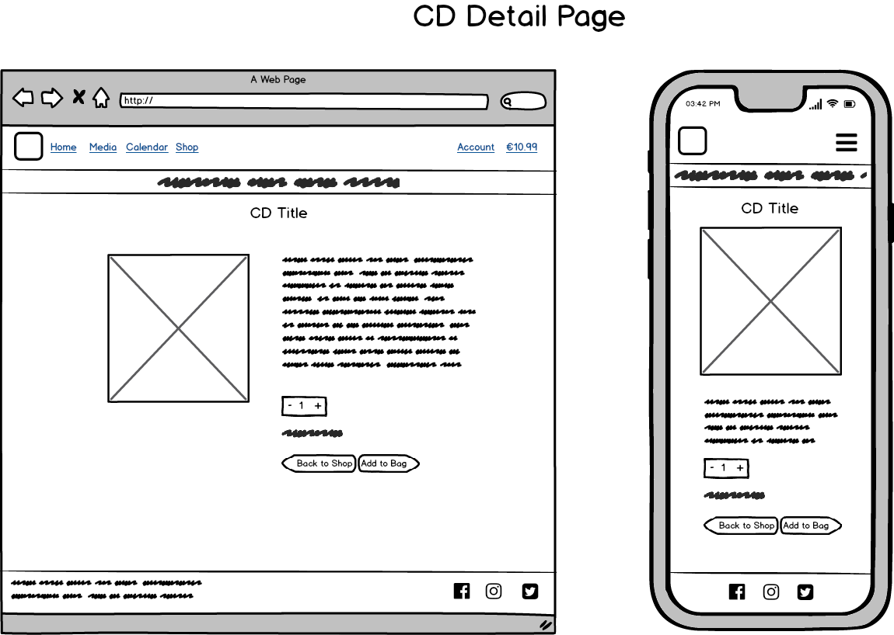
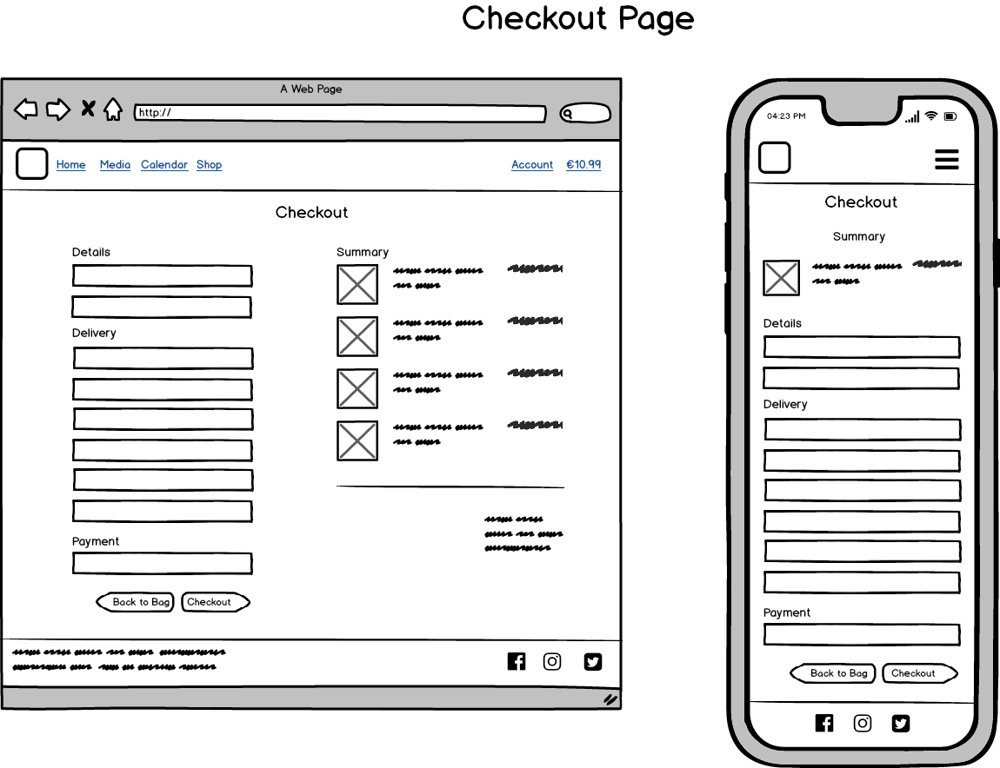
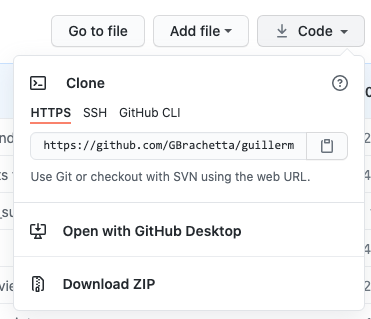
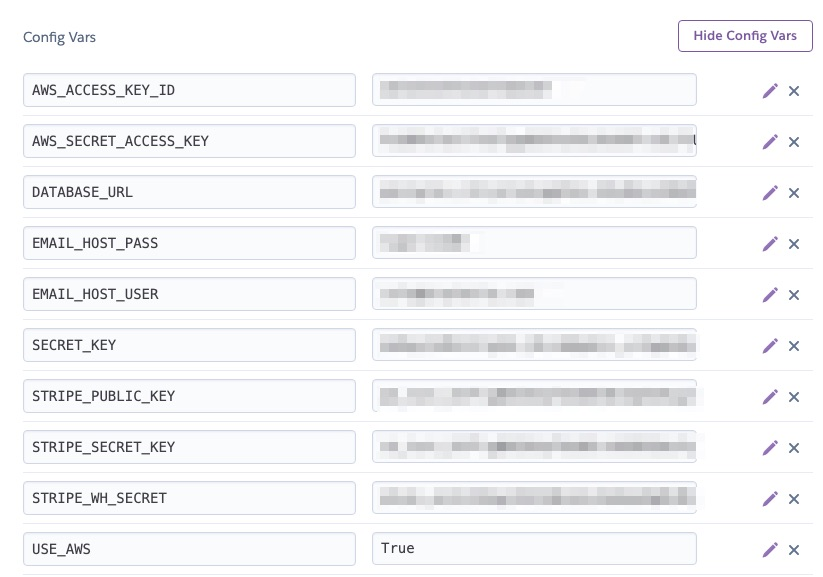

# [Guillermo Brachetta](https://guillermo.herokuapp.com/) <!-- omit in toc -->


## Table of Contents

- [Table of Contents](#table-of-contents)
- [Introduction](#introduction)
- [UX](#ux)
  - [What is the purpose of the app](#what-is-the-purpose-of-the-app)
  - [Who is this website for](#who-is-this-website-for)
  - [Who are the primary target groups](#who-are-the-primary-target-groups)
  - [What is it that they want to achieve](#what-is-it-that-they-want-to-achieve)
  - [How is my project the best way to help them achieve those things](#how-is-my-project-the-best-way-to-help-them-achieve-those-things)
- [Project Goals](#project-goals)
- [User Stories](#user-stories)
- [Design Choices](#design-choices)
  - [General](#general)
  - [Buttons](#buttons)
  - [Colors](#colors)
  - [Fonts](#fonts)
  - [Bootstrap](#bootstrap)
- [Wireframes](#wireframes)
- [Features](#features)
  - [Existing Features](#existing-features)
    - [Login](#login)
    - [Account managment](#account-managment)
    - [Administrators](#administrators)
    - [Images](#images)
  - [Future Goals](#future-goals)
- [Information Architecture](#information-architecture)
  - [Models](#models)
  - [Data Storage](#data-storage)
- [Technologies Used](#technologies-used)
  - [Front-end Technologies](#front-end-technologies)
  - [Back-end Technologies](#back-end-technologies)
  - [Other technologies](#other-technologies)
- [Testing](#testing)
  - [Validators and linters](#validators-and-linters)
- [Deployment](#deployment)
  - [Local Development](#local-development)
  - [Heroku](#heroku)
  - [Version Control](#version-control)
- [Credits](#credits)
  - [Content](#content)
  - [Media](#media)
  - [Code](#code)
  - [Acknowledgements](#acknowledgements)
- [Disclaimer](#disclaimer)

---

## Introduction

The app lets a musician showcase their portfolio and connect with people interested in their work, activities, personal life and recordings they offer on sale.

Users can engage with this content in a visual and auditive way, discover more about the artist, be aware of future concerts, get to know them more closely through text, pictures and video and purchase their albums.

It also allows them to register, log in, and have an overview of their order history.

The app gives administrators a very intuitive way to add, edit and delete media to the album (video and pictures), CDs to the shop and events to the calendar.

The live version of the app can be found **[here](https://guillermo-brachetta.herokuapp.com/)**

<div align="right">
    <b><a href="#table-of-contents">↥ Back To Top</a></b>
</div>

## UX

### What is the purpose of the app

The ultimate goal of the app is to encourage people to discover the artist and connect to them. The app informs them about future and past events, offers media for them to get to know the artist and their art and purchase their recordings.

### Who is this website for

This website is intended for the author, to showcase his work and activities, and for the public to discover them.

### Who are the primary target groups

The website is aimed at a general public, the target in general ranging from young adults onwards, in general educated people and with an inclination about classical (baroque) music.

Concert organisers will also benefit by being aware of the artist's calendar of activities and having a clear way to contact them.

### What is it that they want to achieve

Users will either want to share find information about the artist, know when they could attend to one of their concerts and buy their recordings.

### How is my project the best way to help them achieve those things

The app provides as much information about the artist as possible while keeping it decluttered. The web is the most appropriate vector to share multimedia such as sound, images and video, and gives the user the chance to purchase CDs and the site owner an effective channel to promote themselves.

The app features information on several aspects, professional and personal, aimed at creating a relationship between the site owner and the visitor.

Users can create a profile if they are interested in purchasing a CD, but the app lets anonymous users to freely browse all information in it.

Registered users can also edit all information related to their account and request a password reset.

Administrators are able to update the database on site by adding, editing and deleting media, events and albums.

To make all interaction as clear as possible, buttons are available only when they are permitted to the privileges of a registered user or admin. Access to admin-only pages are forbidden for plain users.

No anonymous writing to the database is permitted by the app.

<div align="right">
    <b><a href="#table-of-contents">↥ Back To Top</a></b>
</div>

## Project Goals

The main goals of the site for the owner are:

- Showcase their activities.
- Let the visitor know about who they are, what they do and when.
- Offer a platform to display their work and sell it.
- Give a clear way to get in touch and be contacted.
- Promote their concerts and activities by offering clear information of past and future engagements.
- Spread the love for baroque music in general and harpsichord in particular.

The main goals of the site for the visitors are:

- Get to know and connect with the artist.
- Know clearly where and when they can attend one of their concerts.
- Discover how they present themselves by looking at the media album.
- Have a preview of their art by watching their videos.
- Discover what CDs they offer on sale and be able to purchase them from home.

<div align="right">
    <b><a href="#table-of-contents">↥ Back To Top</a></b>
</div>

## User Stories

- As a user, I would like to be visually engaged when I land on the site.
- As a user, I would like to know who the artist is.
- As a user, I would like to be able to see what their looks are by visiting a media gallery.
- As a user, I would like to be able to see them in video by visiting a media gallery.
- As a user, I would like to be able to listen to what they do by visiting a media gallery.
- As a user, I would like to know his biography and experience.
- As a user, I would like to know what they thinks about being an artist.
- As a user, I would like to be able to easily find information about events, well organised and displaying date, time and venue.
- As a user, I would like to know when and were have them performed before.
- As a user, I would like to be able to see what CDs has the artist recorded.
- As a user, I would like to be able to purchase securely the CDs.
- As a user, I would like to be able to register an account so I can make future purchases without needing to enter my customer information again.
- As a user, I would like to be able to see my order history.
- As a user, I would like to be able to update my user details.
- As a user, I would like to see clearly what's in my shopping bag at all times.

- As the site owner, I would like to be able to add media (video and photo) and have it automatically added to my album with no extra effort.
- As the site owner, I would like to be able to edit media (video and photo) and have it automatically update my album with no extra effort.
- As the site owner, I would like to be able to delete media (video and photo) and have it automatically disappear from my album with no extra effort.
- As the site owner, I would like to be able to add events so they display automatically on my site in the right grid and order.
- As the site owner, I would like to be able to modify events so they update automatically on my site in the right grid and order.
- As the site owner, I would like to be able to delete events so they disappear automatically from my site.
- As the site owner, I would like to be able to add new items to my shop, having them populate it automatically without breaking the layout.
- As the site owner, I would like to be able to edit existing items in my shop, having them reflex the changes automatically without breaking the layout.
- As the site owner, I would like to be able to delete existing items in my shop, making them disappear from the shop without breaking the layout.
- As the site owner, I would like to be able to replace photos, and have a preview of the image I'm about to upload.

<div align="right">
    <b><a href="#table-of-contents">↥ Back To Top</a></b>
</div>

## Design Choices

### General

The navigation and footer are present throughout the site and possess a strong iconographic characteristic to accentuate the purpose.

The landing page relies basically on big background images that display the artist's personal views about his passion. A biography can be accessed at the end of the images on a separate modal.

The rest of the content has a more relaxed approach, focusing on individual visual elements to avoid distraction. For that reason, the color palette has been kept discreet so the visitor would focus their attention on the relevant items.

### Buttons

Buttons have been kept discreet and monochromatic, with a clear purpose of focussing on what they do without further distractions for the visitor.

### Colors

The color palette has been kept to a minimum, having chosen dark gray for navbar and footer, white for background and a shade of dark yellow for nav items and to highlight relevant information.
Dark red has been chosen for the logo as the only occurrence of that color to differentiate it, and a shade of magenta for accenting some keywords.


### Fonts

Montserrat was the font of choice for its excellent legibility specially on small screens and timeless elegance.

### Bootstrap

I chose Bootstrap (v.4.5) for my CSS framework.

<div align="right">
    <b><a href="#table-of-contents">↥ Back To Top</a></b>
</div>

## Wireframes

> **Note**:The app evolved and several improvements were put in place through development.
>
> The wireframes served as guidelines but some details such as positioning, placement of objects, images and buttons and other refinements diverge from the original wireframes on the current state of the application.
>
> Since there's virtually little to no difference between tablet view and desktop view besides the navbar collapsing on smaller tablets, wireframes for them have been omitted






<div align="right">
    <b><a href="#table-of-contents">↥ Back To Top</a></b>
</div>

## Features

### Existing Features

#### Login

Users can create an account and log in.
This gives registered users the possibility to purchase items from the shop.

#### Account managment

- Users can edit their account and change their information.
- Users can request a password reset in case they forget it.

#### Administrators

  - Admins can add, edit and delete any item in the database without exiting the app (except deleting users).

#### Images

All images interacting with the database are dynamically stored in AWS S3, together with all other static files.

Admins can upload CD photos using the interface provided. In case a photo is not provided during the creation of the CD, a default generic picture will be displayed as a fallback.

### Future Goals

Upon assessment of this app, future goals will be:
- Use the live version of Stripe to accept payments.
- Offer customers more payment methods, such as debit card, PayPal or money transfer.
- Put in place stock control.
- Offer users the possibility to register and login with social accounts.

<div align="right">
    <b><a href="#table-of-contents">↥ Back To Top</a></b>
</div>

## Information Architecture

### Models

Several Models have been used.

For the Gallery:

```python
class Photo(models.Model):
    name = models.CharField(max_length=254)
    caption = models.TextField()
    image_url = models.URLField(max_length=1024, null=True, blank=True)
    image = models.ImageField(upload_to=random_filename, null=True, blank=True)
```

For the Events:

```python
class Event(models.Model):
    name = models.CharField(max_length=254, null=False, blank=False)
    venue = models.CharField(max_length=254, null=False, blank=False)
    programme = models.TextField(null=False, blank=False)
    date = models.DateField(auto_now_add=False, null=False, blank=False)
    time = models.TimeField(auto_now_add=False, null=False, blank=False)
    event_url = models.URLField(max_length=1024, null=True, blank=True)
```

For the Checkout:

```python
class Order(models.Model):
    order_number = models.CharField(max_length=32, null=False, editable=False)
    user_profile = models.ForeignKey(
        UserProfile,
        on_delete=models.SET_NULL,
        null=True,
        blank=True,
        related_name="orders",
    )
    full_name = models.CharField(max_length=50, null=False, blank=False)
    email = models.EmailField(max_length=254, null=False, blank=False)
    phone_number = models.CharField(max_length=20, null=False, blank=False)
    country = CountryField(blank_label="Country *", max_length=40, null=False, blank=False)
    postcode = models.CharField(max_length=20, null=True, blank=True)
    town_or_city = models.CharField(max_length=40, null=False, blank=False)
    street_address1 = models.CharField(max_length=80, null=False, blank=False)
    street_address2 = models.CharField(max_length=80, null=True, blank=True)
    date = models.DateTimeField(auto_now_add=True)
    delivery_cost = models.DecimalField(max_digits=6, decimal_places=2, null=False, default=0)
    order_total = models.DecimalField(max_digits=10, decimal_places=2, null=False, default=0)
    order_items = models.DecimalField(max_digits=4, decimal_places=2, null=False, default=0)
    grand_total = models.DecimalField(max_digits=10, decimal_places=2, null=False, default=0)
    original_bag = models.TextField(null=False, blank=False, default="")
    stripe_pid = models.CharField(max_length=254, null=False, blank=False, default="")
```

```python
class OrderLineItem(models.Model):
    order = models.ForeignKey(Order, null=False, blank=False, on_delete=models.CASCADE, related_name="lineitems",)
    cd = models.ForeignKey(Cd, null=False, blank=False, on_delete=models.CASCADE)
    quantity = models.IntegerField(null=False, blank=False, default=0)
    lineitem_total = models.DecimalField(max_digits=6, decimal_places=2, null=False, blank=False, editable=False)
```

For the profiles:

```python
class UserProfile(models.Model):
    user = models.OneToOneField(User, on_delete=models.CASCADE)
    default_phone_number = models.CharField(max_length=20, null=True, blank=True)
    default_street_address1 = models.CharField(max_length=80, null=True, blank=True)
    default_street_address2 = models.CharField(max_length=80, null=True, blank=True)
    default_town_or_city = models.CharField(max_length=40, null=True, blank=True)
    default_postcode = models.CharField(max_length=20, null=True, blank=True)
    default_country = CountryField(blank_label="Country", max_length=40, null=True, blank=True)
```

For the Shop:

```python
class Cd(models.Model):
    sku = models.CharField(max_length=10, null=True, blank=True)
    name = models.CharField(max_length=254)
    description = models.TextField()
    price = models.DecimalField(max_digits=6, decimal_places=2)
    image_url = models.URLField(max_length=1024, null=True, blank=True)
    image = models.ImageField(null=True, blank=True)
```

They have been altered and given extra functionality with methods, decorators and classes.

### Data Storage

No data is stored in the file system.

Since Heroku has an ephemeral file system all static files are stored in an AWS S3 bucket.

<div align="right">
    <b><a href="#table-of-contents">↥ Back To Top</a></b>
</div>

## Technologies Used

### Front-end Technologies

[](https://www.w3schools.com/html/)  HTML: Used for markup.
[](https://developer.mozilla.org/en-US/docs/Web/CSS) CSS: Used to style the elements of the app.
[](https://getbootstrap.com/) Bootstrap: to make use of its grid system and responsiveness.
[](https://www.w3schools.com/Js/) JavaScript: Used for the functionality of the app.
[](https://jquery.com/) jQuery, to access and manipulate the DOM.
[](https://fontawesome.com/) Font Awesome, for all icons.
[](https://greensock.com/gsap/) GSAP, for the animations on the landing page.

### Back-end Technologies

[](https://www.djangoproject.com/) Python, for all backend logic.
[](https://www.python.org/) Python, for all backend logic.
[](https://django-allauth.readthedocs.io/en/latest/index.html) Python, for all backend logic.
[](https://django-allauth.readthedocs.io/en/latest/index.html) Python, for all backend logic.
[](https://django-allauth.readthedocs.io/en/latest/index.html) Python, for all backend logic.
[](https://django-allauth.readthedocs.io/en/latest/index.html) Python, for all backend logic.
[](https://django-allauth.readthedocs.io/en/latest/index.html) Python, for all backend logic.

### Other technologies

[](https://code.visualstudio.com/) Visual Studio Code: my IDE of choice for all my projects.
[](https://github.com/GBrachetta)  GitHub: My remote storage for this project.
[](https://www.heroku.com/) Heroku, the patform to deploy the app.
[](https://balsamiq.com/) Balsamiq: to create the wireframes of this project.


<div align="right">
    <b><a href="#table-of-contents">↥ Back To Top</a></b>
</div>

## Testing

Testing can be viewed in this [external file](wireframes/testing.md).

### Validators and linters

The following validators and linters were used either remotely or with their plugins for Visual Studio Code:

- [W3C HTML Validator](https://validator.w3.org/)
- [W3C CSS Validator](https://jigsaw.w3.org/css-validator/)
- [CSS Lint](http://csslint.net/)
- [JSHint](https://jshint.com/)
- [PEP8](http://pep8online.com/)
- [BLACK](https://pypi.org/project/black/)

<div align="right">
    <b><a href="#table-of-contents">↥ Back To Top</a></b>
</div>

## Deployment

### Local Development

This project can be ran locally by following these steps:

1. Visit this [Repository link](https://github.com/GBrachetta/guillermo) and click on the Clone or Download button to copy the link provided.

    

2. In your IDE, open a Terminal window and change to the directory where you want to clone this project and type:

    `Git clone "your copied link"`

    After pressing Enter the project will be created and cloned locally.

    (Alternatively you can download the zipped file, decompress it and use your IDE of choice to access it.)

3. Make sure you either have access to your email server settings and credentials or to your cloud based email, such as [Gmail](https://accounts.google.com/b/0/AddMailService).
4. Install [Pipenv](https://pipenv.pypa.io/en/latest/). This app was developed on a Mac, and on MacOS you can install pipenv by typing `brew pipenv` (provided you have [Homebrew](https://brew.sh/) installed).
5. Create a virtual enviroment by typing

   `pipenv shell`

6. Install all dependencies present in pipfile by executing

   `pipenv install`

7. Make sure to have a test account on [Stripe]("https://stripe.com/en-nl")

8. Create a series of enviroment variables following the below criteria.

    ```json
   {
       "DEVELOPMENT": true,
       "SECRET_KEY": "your_secret_key",
       "DATABASE_URL": "your_link_to_your_postgress_db",
       "STRIPE_PUBLIC_KEY": "your_Stripe_PK",
       "STRIPE_SECRET_KEY": "your_Stripe_SK",
       "STRIPE_WH_SECRET": "your_Stripe_WH_secret"
   }
    ```

    > Please refer to Stripe's documentation in order to create your Webhook handler!.
    > Please modify your app settings.py file accordingly.

9. Run migrations by:

    `python3 manage.py makemigrations (--dry-run)`
    `python3 manage.py migrate (--plan)`

10. Create a superuser by typing in terminal `python3 manage.py createsuperuser`

11. You will then be able to run the app locally by typing either `python3 manage.py runserver`.

### Heroku

[Heroku](https://www.heroku.com/) was chosen as the deployment platform for this project.
The steps to deploy the local app to Heroku were as follow:

1. In Heroku, created an app. The app must have a unique name.
2. Linked that app to the GitHub repository by going to the "Deploy" tab in the main app menu.
3. Selected a branch to deploy automatically (alternatively one could opt to deploy manually instead).
4. Attach an Heroku-Postgress database to the app.
5. In the Settings tab, added the corresponding Config Variables as present in my local development.

    

6. Create an [AWS S3 bucket]("https://s3.console.aws.amazon.com/s3/home")

    > Please refer to AWS' documentation in order to setup a bucket and obtain access to it in the app.
    > Please modify your app settings.py file accordingly.

7. I used [Pipenv](https://pipenv.pypa.io/en/latest/) to deal with my virtual enviroment, which creates a pipfile for the dependencies needed for the app and a pipfile.lock to deal with versioning of these dependencies.
8. This pipfile renders the file 'requirements.txt' unnecessary, so it was not included in the project.
9. I installed the dependency [Gunicorn](https://gunicorn.org/) which is a Python WSGI HTTP Server.
10. I also created a "Procfile", needed by Heroku in order to know how to run the app and instructed it to run my app using the Gunicorn server in it.
11. When deploying, Heroku reads the pipfiles to install the dependencies, reads the Procfile and the Config Variables inserted above.
12. After that process, the app was live and running remotely in Heroku's servers.

### Version Control

During the development I used [GitFlow](https://www.atlassian.com/git/tutorials/comparing-workflows/gitflow-workflow) for version control.

By this I was able to isolate features in different branches and integrated them as soon as they were finished and fully tested.

As soon as I considered that a feature was finished I then merged its branch to the develop branch. I then deleted stale branches once they were sufficiently tested and approved for release.

When a group of features made a release worthwhile I then merged the develop branch to the master branch.

Additionally, and for testing purposes, I often also deployed feature branches in order to double-check that the app was responsive remotely.

Over 20 branches were using during the development of this app, to ensure isolated enviroments for each of them without interfering with already functioning features.

To deal with these features i used [GitHub issues](https://guides.github.com/features/issues/) and put in place a [project board](https://help.github.com/en/github/managing-your-work-on-github/about-project-boards), which helped me organise my workflow and have a clear overview of where in the process of my development I was.

<div align="right">
    <b><a href="#table-of-contents">↥ Back To Top</a></b>
</div>

## Credits

### Content

- All content is of my property or free domain.

### Media

- I'm the owner of all rights of the images, media, video, music used in this site.
- Photos are taken by different photographers and are acknowledged in the respective slide in the gallery.

### Code

Code was written by the author for the present app, albeit inspired by freely available tutorials, instructional documentation and open source examples.
On such instances, the sources have been mentioned in the code where it corresponds.
Notable sources of information, inspiration and source to sort problems are:

- [Code Institute]("https://codeinstitute.net/") and the excellent Django tutorial by [CKZ8780]("https://github.com/ckz8780")
- [Stack Overflow](https://stackoverflow.com/)
- [W3Schools](https://www.w3schools.com/)
- Mi loyal mentor, [Simen Daehlin](https://github.com/Eventyret)

### Acknowledgements

## Disclaimer

This app and its deployment are for instructional purposes only, not intended comercially in any way and its eventual copyright infringments involuntary.

<div align="right">
    <b><a href="#table-of-contents">↥ Back To Top</a></b>
</div>
