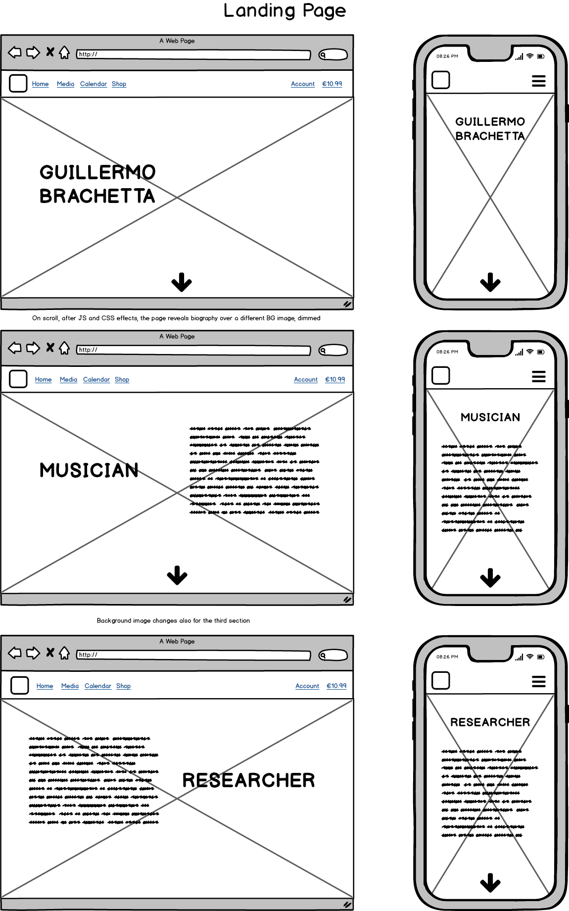
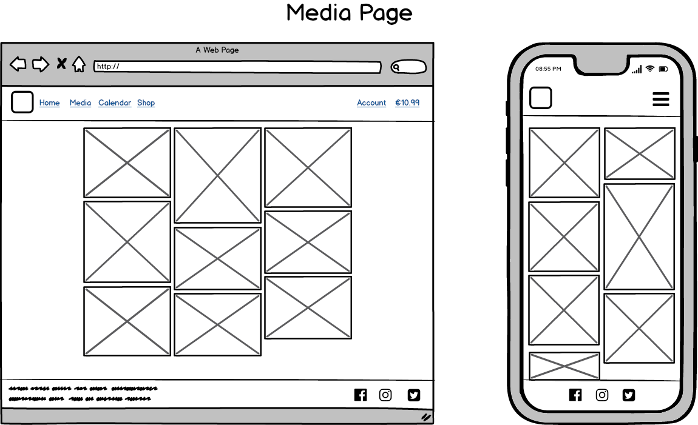
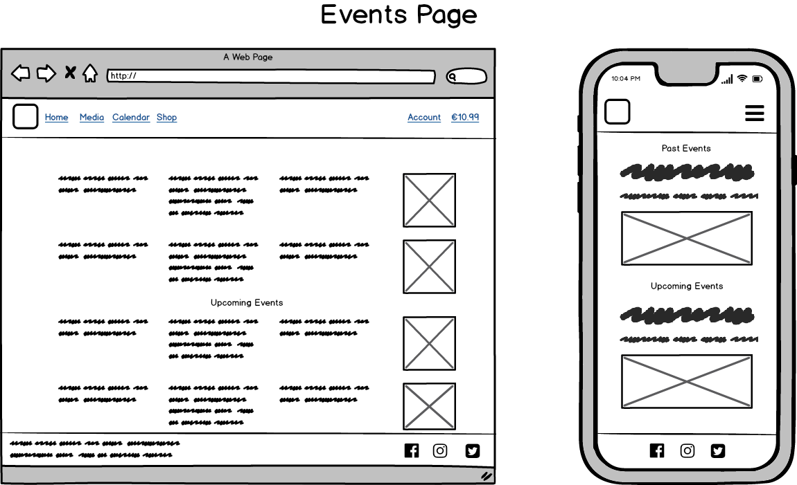

# [Guillermo Brachetta](https://guillermo.herokuapp.com/) <!-- omit in toc -->

## Table of Contents

- [Table of Contents](#table-of-contents)
- [Introduction](#introduction)
- [UX](#ux)
  - [What is the purpose of the app](#what-is-the-purpose-of-the-app)
  - [Who is this website for](#who-is-this-website-for)
  - [Who are the primary target groups](#who-are-the-primary-target-groups)
  - [What is it that they want to achieve](#what-is-it-that-they-want-to-achieve)
  - [How is my project the best way to help them achieve those things](#how-is-my-project-the-best-way-to-help-them-achieve-those-things)
  - [How do users achieve each of the following goals](#how-do-users-achieve-each-of-the-following-goals)
- [Project Goals](#project-goals)
- [User Stories](#user-stories)
- [Design Choices](#design-choices)
  - [General](#general)
  - [Buttons](#buttons)
  - [Colors](#colors)
  - [Fonts](#fonts)
  - [Bootstrap](#bootstrap)
- [Wireframes](#wireframes)
- [Features](#features)
  - [Existing Features](#existing-features)
    - [Login](#login)
    - [Account managment](#account-managment)
    - [Administrators](#administrators)
    - [Images](#images)
  - [Future Goals](#future-goals)
- [Information Architecture](#information-architecture)
  - [Models](#models)
  - [Data Storage](#data-storage)
- [Technologies Used](#technologies-used)
  - [Front-end Technologies](#front-end-technologies)
  - [Back-end Technologies](#back-end-technologies)
  - [Other technologies](#other-technologies)
  - [About Cloudinary](#about-cloudinary)
- [Testing](#testing)
  - [Tests performed](#tests-performed)
  - [Validators and linters](#validators-and-linters)
- [Deployment](#deployment)
  - [Local Development](#local-development)
  - [Heroku](#heroku)
  - [Version Control](#version-control)
- [Credits](#credits)
  - [Content](#content)
  - [Media](#media)
  - [Code](#code)
  - [Acknowledgements](#acknowledgements)
- [Disclaimer](#disclaimer)

---
## Introduction

The live version of the app can be found **[here](https://guillermo.herokuapp.com/)**

    <b><a href="#table-of-contents">↥ Back To Top</a></b>

## UX

### What is the purpose of the app

### Who is this website for

### Who are the primary target groups

### What is it that they want to achieve

### How is my project the best way to help them achieve those things

### How do users achieve each of the following goals

    <b><a href="#table-of-contents">↥ Back To Top</a></b>

## Project Goals

    <b><a href="#table-of-contents">↥ Back To Top</a></b>

## User Stories

    <b><a href="#table-of-contents">↥ Back To Top</a></b>

## Design Choices

### General

### Buttons

### Colors

### Fonts

### Bootstrap

    <b><a href="#table-of-contents">↥ Back To Top</a></b>

## Wireframes

    <b><a href="#table-of-contents">↥ Back To Top</a></b>

## Features

### Existing Features

#### Login

#### Account managment

#### Administrators

#### Images

### Future Goals

    <b><a href="#table-of-contents">↥ Back To Top</a></b>

## Information Architecture

### Models

### Data Storage

    <b><a href="#table-of-contents">↥ Back To Top</a></b>

## Technologies Used

### Front-end Technologies

-   HTML: Used for markup.
-  CSS: Used to style the elements of the app.
-  Bootstrap: to make use of its grid system and responsiveness.
-  JavaScript: Used for the functionality of the app.
-  jQuery, to access and manipulate the DOM.
-  Font Awesome, for all icons.

### Back-end Technologies

-  Python, for all backend logic.

### Other technologies

-  Visual Studio Code: my IDE of choice for all my projects.
-   GitHub: My remote storage for this project.
-  Heroku, the patform to deploy the app.
-  Balsamiq: to create the wireframes of this project.
-  Cloudinary: to upload and host images.

### About Cloudinary

    <b><a href="#table-of-contents">↥ Back To Top</a></b>

## Testing

### Tests performed

### Validators and linters

The following validators and linters were used either remotely or with their plugins for Visual Studio Code:

- [W3C HTML Validator](https://validator.w3.org/)
- [W3C CSS Validator](https://jigsaw.w3.org/css-validator/)
- [CSS Lint](http://csslint.net/)
- [JSHint](https://jshint.com/)
- [PEP8](http://pep8online.com/)
- [BLACK](https://pypi.org/project/black/)

    <b><a href="#table-of-contents">↥ Back To Top</a></b>

## Deployment

### Local Development

### Heroku

### Version Control

    <b><a href="#table-of-contents">↥ Back To Top</a></b>

## Credits

### Content

### Media

### Code

### Acknowledgements

## Disclaimer

This app and its deployment are for instructional purposes only, not intended comercially in any way and its eventual copyright infringments involuntary.

    <b><a href="#table-of-contents">↥ Back To Top</a></b>

